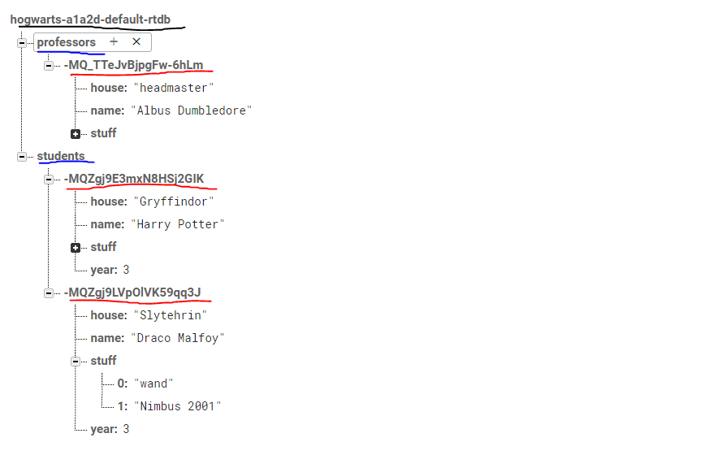

# Firebase Realtime DB

## Database Structure



- hierarchy based
- need to traverse the tree to access/modify property
- think of it like the linux file system
## NodeJS

### Prerequisites
```bash
$ npm init -y
$ npm install firebase
```

### Connect Firebase w/ your app
config.js
```javascript
const CONFIG = 
{
    apiKey: "INSERT API KEY HERE",
    authDomain: "INSERT AUTH DOMAIN HERE",
    databaseURL: "INSERT DB URL HERE",
    projectId: "INSERT PROJECT ID HERE",
    storageBucket: "INSERT STORAGE BUCKET HERE",
    messagingSenderId: "INSERT MESSAGING SENDER ID HERE",
    appId: "INSERT APP ID HERE",
    measurementId: "INSERT MEASUREMENT ID HERE"
};
export default CONFIG
```

index.js
```javascript
import firebase from "firebase"
import CONFIG from './config.js'

// initialize connection
firebase.initializeApp(CONFIG)

// get database
const DB = firebase.database()

// get collections
const COLLECTION = DB.ref("insert collection name here")

// additional collections inserted here
...
```
### Insert an entry
```javascript
COLLECTION.push
(
    {
        name:"omruti",
        favStuff: ["django", "literature", "tom and jerry", "spongebob"],
        hasRealComputer: false,
        favBook: "Harry Potter",
        studentNumber: 313
    }
)
```

### Find all 
```javascript
COLLECTION.on('value', 
res => 
{
    let results = res.val()
    // logic of result goes here
},
err =>
{
    console.log(err)
    // error handling logic goes here
})
```

### Find by id 
```javascript
let entry = COLLECTION.child("INSERT KEY HERE")
entry.on('value', 
res => 
{
    let results = res.val()
    // logic of result goes here
},
err =>
{
    console.log(err)
    // error handling logic goes here
})
```
### Delete all entries
```javascript
COLLECTION.remove()
.catch(err => console.log(err))
```

### Delete an entry by id
```javascript
COLLECTION.child("INSERT ID HERE").remove()
.catch(err => console.log(err))
```